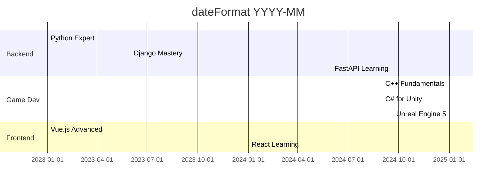

## About Me

- 🎬 **Streamer** and former **e-sport caster**
- 💻 **Developer** specializing in Python, HTML/CSS, C and Java
- 📚 **Currently learning**: C++ and C#
- 🎯 **Unreal Engine 5** user


## Tech Stack

<table align="center">
<tr>
    <td align="center" width="96">
        
        <br>Python
    </td>
    <td align="center" width="96">
        
        <br>JavaScript
    </td>
    <td align="center" width="96">
        
        <br>C
    </td>
    <td align="center" width="96">
        
        <br>Java
    </td>
    <td align="center" width="96">
        
        <br>HTML5
    </td>
    <td align="center" width="96">
        
        <br>CSS3
    </td>
    <td align="center" width="96">
        
        <br>PHP
    </td>
    <td align="center" width="96">
        
        <br>PowerShell
    </td>
    <td align="center" width="96">
        
        <br>Markdown
    </td>
</tr>
</table>

<table align="center">
<tr>
    <td align="center" width="96">
        
        <br>Docker
    </td>
    <td align="center" width="96">
        
        <br>Git
    </td>
    <td align="center" width="96">
        
        <br>VS Code
    </td>
    <td align="center" width="96">
        
        <br>MongoDB
    </td>
    <td align="center" width="96">
        
        <br>MySQL
    </td>
    <td align="center" width="96">
        
        <br>SQLite
    </td>
    <td align="center" width="96">
        
        <br>GitHub
    </td>
    <td align="center" width="96">
        
        <br>MATLAB
    </td>
    <td align="center" width="96">
        
        <br>Notion
    </td>
</tr>
</table>

<table align="center">
<tr>
    <td align="center" width="96">
        
        <br>Django
    </td>
    <td align="center" width="96">
        
        <br>React
    </td>
    <td align="center" width="96">
        
        <br>Vue.js
    </td>
    <td align="center" width="96">
        
        <br>Node.js
    </td>
    <td align="center" width="96">
        
        <br>FastAPI
    </td>
    <td align="center" width="96">
        
        <br>Flask
    </td>
</tr>
</table>


<table align="center">
<tr>
    <td align="center" width="96">
        
        <br>Unreal Engine
    </td>
    <td align="center" width="96">
        
        <br>Unity
    </td>
    <td align="center" width="96">
        
        <br>Godot
    </td>
    <td align="center" width="96">
        
        <br>Premiere Pro
    </td>
    <td align="center" width="96">
        
        <br>Photoshop
    </td>
</tr>
</table>

---

## GitHub Statistics

<div align="center">

### � Overview

<p align="center">
  
</p>

### 📈 Activity Analysis

<p align="center">
  
  
</p>

<p align="center">
  
  
</p>

### 📅 Contribution Timeline

<p align="center">
  
</p>

</div>

---

## 📚 Learning Roadmap



---

## 📫 Let's Connect

<div align="center">

[](mailto:contactrowuni@gmail.com)
[](https://github.com/Rowuni)
[](https://linkedin.com/in/votreprofil)
[](https://twitter.com/votrecompte)
[](https://twitch.tv/votrecompte)
[](https://youtube.com/@votrecompte)

</div>

<div align="center">


[](https://github.com/Rowuni)

</div>


<!-- Footer animé -->
<div align="center">


<sub> Last updated: December 2025 </sub>

</div>


═══════════════════════════════════════════════════════════════════════════
  VARIANTES DE HEADERS DISPONIBLES (décommenter pour changer le style)
═══════════════════════════════════════════════════════════════════════════

Cylindre:


Transparent avec animation:


Shark:


Slice:


Rect:


Soft:


Rounded:


Venom:


Egg:


═══════════════════════════════════════════════════════════════════════════
  MÉTRIQUES AVANCÉES (nécessite GitHub Action - décommenter si configuré)
═══════════════════════════════════════════════════════════════════════════


═══════════════════════════════════════════════════════════════════════════
  PROFIL 3D DES CONTRIBUTIONS ⚠️ Nécessite GitHub Action
═══════════════════════════════════════════════════════════════════════════

Pour activer ces visualisations 3D, vous devez configurer la GitHub Action:
https://github.com/yoshi389111/github-profile-3d-contrib

Une fois configuré, décommentez l'un des styles ci-dessous:


---


STYLE 2: Night Rainbow (arc-en-ciel nocturne)


STYLE 3: Night View (vue de nuit)


STYLE 4: Night Green (vert nocturne - style GitHub)


STYLE 5: Season (animation des saisons)


STYLE 6: Season Animate (saisons animées)


STYLE 7: South Season (saisons sud)


STYLE 8: Green (vert classique)


STYLE 9: Green Animate (vert animé)


STYLE 10: Isometric (vue isométrique personnalisée)


STYLE 11: GitBlock Dark (blocs sombres)


═══════════════════════════════════════════════════════════════════════════

CONFIGURATION DE LA GITHUB ACTION:

1. Créez un fichier .github/workflows/profile-3d.yml dans votre repo de profil
2. Copiez ce contenu:

```yaml
name: GitHub-Profile-3D-Contrib

on:
  schedule:
    - cron: "0 18 * * *"
  workflow_dispatch:

jobs:
  build:
    runs-on: ubuntu-latest
    name: generate-github-profile-3d-contrib
    steps:
      - uses: actions/checkout@v3
      - uses: yoshi389111/github-profile-3d-contrib@0.7.1
        env:
          GITHUB_TOKEN: ${{ secrets.GITHUB_TOKEN }}
          USERNAME: ${{ github.repository_owner }}
      - name: Commit & Push
        run: |
          git config user.name github-actions
          git config user.email github-actions@github.com
          git add -A .
          git commit -m "generated"
          git push
```

3. Après la première exécution, les fichiers SVG seront générés dans ./profile-3d-contrib/
4. Décommentez le style de votre choix ci-dessus

═══════════════════════════════════════════════════════════════════════════


Modifier parcours pour avoir genre parcours scolaire
Parcours professionnel (expériences pro etc.)
Parcours perso (projets personnels etc.)
