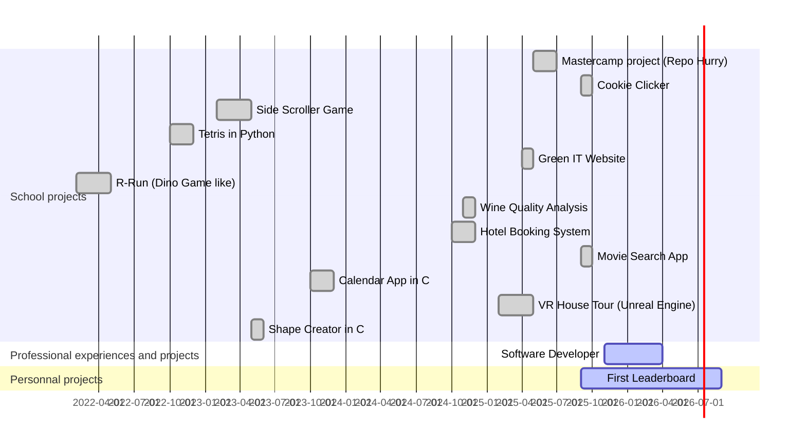

## About Me

- 🎬 **Streamer** and former **e-sport caster**
- 💻 **Developer** specializing in Python, HTML/CSS, C and Java
- 🎓 **Student** at EFREI Paris, pursuing a Master's degree in Computer Science and Software Engineering 
- 📚 **Currently learning**: C++ and C#
- 🎯 **Unreal Engine 5** user

 

## Tech Stack

<table align="center">
<tr>
    <td align="center" width="96">
        
         Python
    </td>
    <td align="center" width="96">
        
         JavaScript
    </td>
    <td align="center" width="96">
        
         C
    </td>
    <td align="center" width="96">
        
         Java
    </td>
    <td align="center" width="96">
        
         HTML5
    </td>
    <td align="center" width="96">
        
         CSS3
    </td>
    <td align="center" width="96">
        
         PHP
    </td>
    <td align="center" width="96">
        
         PowerShell
    </td>
    <td align="center" width="96">
        
         Markdown
    </td>
</tr>
</table>

<table align="center">
<tr>
    <td align="center" width="96">
        
         Docker
    </td>
    <td align="center" width="96">
        
         Git
    </td>
    <td align="center" width="96">
        
         VS Code
    </td>
    <td align="center" width="96">
        
         MongoDB
    </td>
    <td align="center" width="96">
        
         MySQL
    </td>
    <td align="center" width="96">
        
         SQLite
    </td>
    <td align="center" width="96">
        
         GitHub
    </td>
    <td align="center" width="96">
        
         MATLAB
    </td>
    <td align="center" width="96">
        
         Notion
    </td>
</tr>
</table>

<table align="center">
<tr>
    <td align="center" width="96">
        
         Django
    </td>
    <td align="center" width="96">
        
         React
    </td>
    <td align="center" width="96">
        
         Vue.js
    </td>
    <td align="center" width="96">
        
         Node.js
    </td>
    <td align="center" width="96">
        
         FastAPI
    </td>
    <td align="center" width="96">
        
         Flask
    </td>
</tr>
</table>

<table align="center">
<tr>
    <td align="center" width="96">
        
         Unreal Engine
    </td>
    <td align="center" width="96">
        
         Unity
    </td>
    <td align="center" width="96">
        
         Godot
    </td>
    <td align="center" width="96">
        
         Premiere Pro
    </td>
    <td align="center" width="96">
        
         Photoshop
    </td>
</tr>
</table>

---

## GitHub Statistics

### 📈 Activity Analysis

  
  

  
  

---

## 📚 Projects and experiences Roadmap

---

## 📫 Let's Connect

<!-- Footer animé -->

 Last updated: January 2026  

