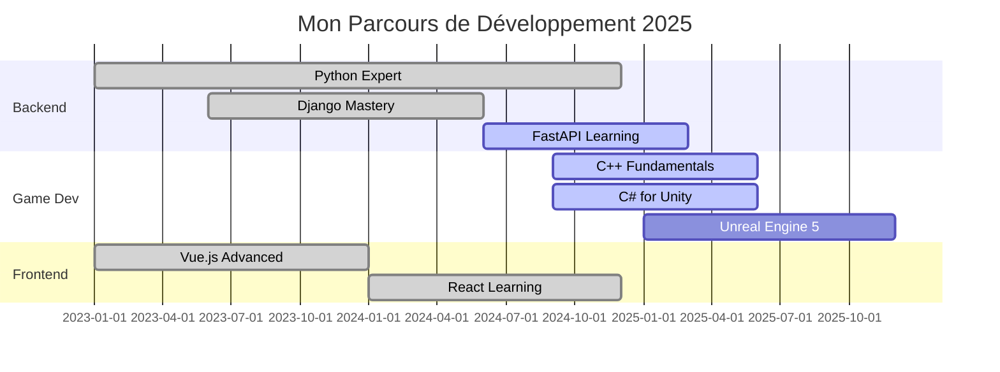

# About me

---

## About Me

- 🎬 **Streamer** and former **e-sport caster**
- 💻 **Developer** specializing in Python, HTML/CSS, C and Java
- 📚 **Currently learning**: C++ and C#
- 🎯 **Unreal Engine 5** user

---

## 🛠️ Technology Stack

### Languages

### Frameworks & Libraries

### Databases & Tools

### Game Development

---

## 📊 GitHub Statistics

  

---

### 📫 Let's Connect

---

## 📈 Tous les Widgets & Statistiques Disponibles

### 🔢 Profile Views Counter (Compteur de vues)

### 💼 Profile Summary (Résumé du profil)

### 🌐 Social Badges (Badges sociaux)

### 🎬 Animated Header (Header animé)

<!-- Variante Vague inversée -->

<!-- Variante Cylindre -->

<!-- Variante Transparent -->

<!-- Variante Shark -->

<!-- Variante Slice -->

---

### 📈 Advanced Metrics (Métriques avancées) ⚠️ Nécessite GitHub Action

<!-- Tous les langages détaillés -->
![Metrics](https://metrics.lecoq.io/Rowuni?template=classic&languages=1&lines=1&achievements=1&notable=1&repositories=1&habits=1&activity=1&code=1&followup=1&people=1&gists=1&introduction=1&base=header%2C%20activity%2C%20community%2C%20repositories%2C%20metadata&base.indepth=false&base.hireable=false&base.skip=false&repositories=100&repositories.batch=100&repositories.forks=false&repositories.affiliations=owner&languages=false&languages.ignored=html%2C%20css&languages.limit=8&languages.threshold=0%25&languages.other=false&languages.colors=github&languages.sections=most-used&languages.indepth=false&languages.analysis.timeout=15&languages.categories=markup%2C%20programming&languages.recent.categories=markup%2C%20programming&languages.recent.load=300&languages.recent.days=14&followup=false&followup.sections=repositories&followup.indepth=false&followup.archived=true&people=false&people.limit=24&people.identicons=false&people.identicons.hide=false&people.size=28&people.types=followers%2C%20following&people.shuffle=false&activity=false&activity.limit=5&activity.load=300&activity.days=14&activity.visibility=all&activity.timestamps=false&activity.filter=all&achievements=false&achievements.threshold=C&achievements.secrets=true&achievements.display=detailed&achievements.limit=0&notable=false&notable.from=organization&notable.repositories=false&notable.indepth=false&notable.types=commit&repositories.pinned=0&gists=false&lines=false&lines.sections=base&lines.repositories.limit=4&lines.history.limit=1&habits=false&habits.from=200&habits.days=14&habits.facts=true&habits.charts=false&habits.charts.type=classic&habits.trim=false&habits.languages.limit=8&habits.languages.threshold=0%25&code=false&code.lines=12&code.load=400&code.days=3&code.visibility=public&introduction=false&introduction.title=true&config.timezone=Europe%2FParis)

---

### 🔗 Profile Summary Extended (Résumé étendu)

<!-- Tous les types de cartes profile-summary -->

### 🌈 Colorful Language Stats (Stats de langages colorés)

### 📬 Contact Badges (Badges de contact)

---

### 🏗️ Tech Stack Grid (Grille de technologies)

<table>
<tr>
    <td align="center" width="96">
        
         Python
    </td>
    <td align="center" width="96">
        
         JavaScript
    </td>
    <td align="center" width="96">
        
         React
    </td>
    <td align="center" width="96">
        
         Vue
    </td>
    <td align="center" width="96">
        
         Node.js
    </td>
    <td align="center" width="96">
        
         Django
    </td>
    <td align="center" width="96">
        
         Docker
    </td>
    <td align="center" width="96">
        
         Git
    </td>
</tr>
<tr>
    <td align="center" width="96">
        
         C++
    </td>
    <td align="center" width="96">
        
         C#
    </td>
    <td align="center" width="96">
        
         C
    </td>
    <td align="center" width="96">
        
         Java
    </td>
    <td align="center" width="96">
        
         MongoDB
    </td>
    <td align="center" width="96">
        
         MySQL
    </td>
    <td align="center" width="96">
        
         Unreal
    </td>
    <td align="center" width="96">
        
         VSCode
    </td>
</tr>
</table>

---

### 🎨 Animated Skill Bars (Barres de compétences animées)

<!-- Via HTML/CSS dans GitHub -->

  

---

### 🎨 More Capsule Render Types (Plus de types de rendus capsule)

---

---

### 📅 Coding Activity by Time (Activité de codage par période)

<!-- Stats par heure -->

### 📚 Learning Roadmap (Feuille de route d'apprentissage)

### 🎨 Profile Banner Generator (Bannière de profil personnalisée)

